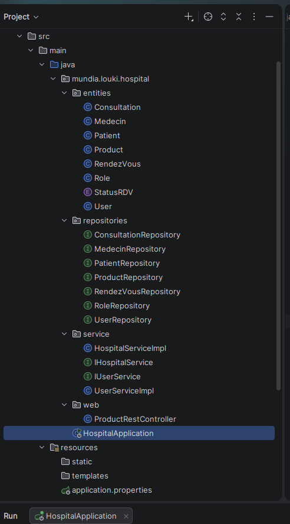
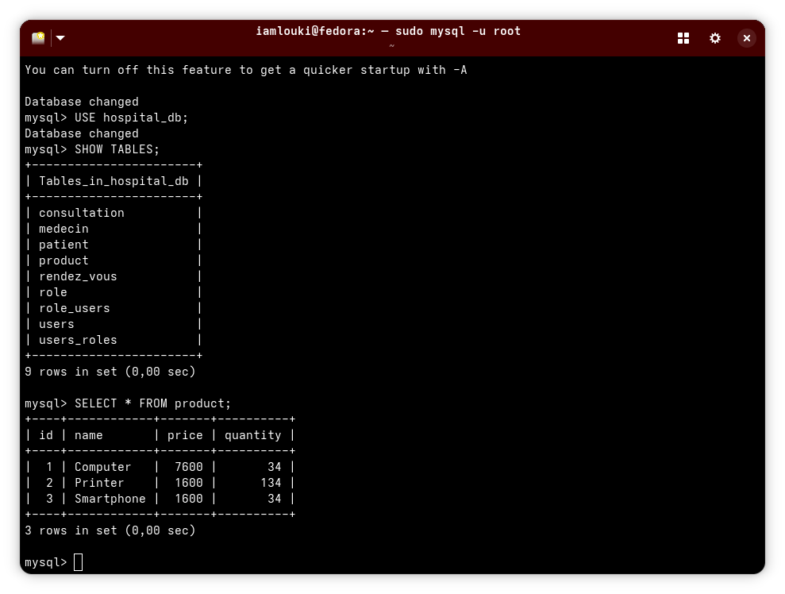

# 🏥 Système de Gestion Hospitalier (Spring Boot & JPA)

> **Projet académique** réalisé dans le cadre du module JEE / Spring Data.
> **Auteur :** Abdel-hamid Mahamat Louki

---

## 📋 Présentation du Projet
Ce projet est une application backend complète développée avec **Spring Boot**. L'objectif était de mettre en œuvre le **Mapping Objet-Relationnel (ORM)** avec JPA, Hibernate et Spring Data.

L'application gère trois modules principaux :
1.  **Produits** (CRUD simple).
2.  **Gestion Hospitalière** (Patients, Médecins, Rendez-vous, Consultations).
3.  **Sécurité** (Utilisateurs et Rôles).

---

## 🏗️ Architecture du Projet

Le projet respecte une architecture en couches (Layered Architecture) pour séparer la logique métier, l'accès aux données et les entités.

*Vue de l'arborescence : Entités, Repositories, Services et Contrôleurs Web.*

---

## ⚙️ Configuration & Migration (H2 vers MySQL)

Le projet a été initialement développé avec une base de données en mémoire (H2) pour le prototypage rapide.

*Phase de développement : Interface de la console H2.*

Ensuite, une migration vers **MySQL** a été effectuée pour assurer la persistance des données en production. Voici la configuration finale dans `application.properties` :

*Configuration de la connexion MySQL et désactivation de H2.*

---

## 💻 Code & Implémentation

L'application utilise l'interface `CommandLineRunner` pour insérer des données de test au démarrage de l'application, ce qui permet de valider le bon fonctionnement des relations entre les entités dès le lancement.

*Extrait de la classe principale HospitalApplication.*

---

## 🚀 Exécution et Tests

### Démarrage de l'application
L'application se lance via Maven ou directement depuis l'IDE. Les logs confirment le démarrage de Tomcat sur le port 8082 et l'initialisation du contexte Spring.

### Validation de la Persistance (Preuve MySQL)
Après exécution, nous pouvons vérifier directement dans la base de données MySQL que les tables ont été créées et les données insérées.

*Requête SQL prouvant que les produits (Computer, Printer...) sont bien enregistrés dans la base MySQL.*

---

## 🛠️ Stack Technique

* **Langage :** Java 17
* **Framework :** Spring Boot 3 (Spring Web, Spring Data JPA)
* **SGBD :** MySQL 8 (Prod) / H2 (Dev)
* **Outils :** Maven, Lombok, IntelliJ IDEA Ultimate
* **OS :** Fedora Linux

---

## 🏁 Conclusion

Ce TP m'a permis de maîtriser :
* Les relations JPA complexes (`@OneToMany`, `@ManyToOne`, `@OneToOne`, `@ManyToMany`).
* L'injection de dépendances et l'Inversion de Contrôle (IoC).
* La gestion des transactions avec `@Transactional`.
* La transition d'un environnement de développement vers un environnement de production.
